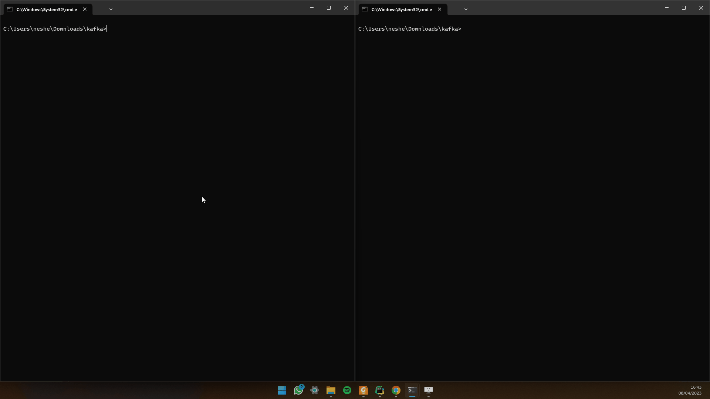
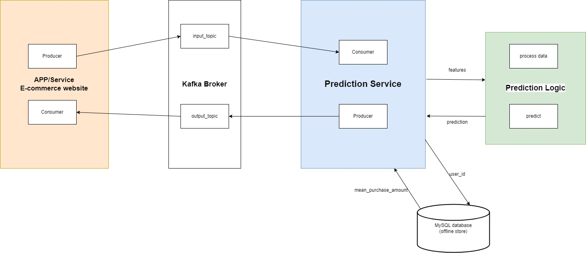

<h2>How to run the Real-time Prediction Service</h2>

1. Clone the repository to your local machine.
2. Make sure you have Python 3.9 or above installed on your machine (`asyncio.to_thread` was added to the asyncio module
in Python 3.9).
3. Install the required dependencies by running the command `pip install -r requirements.txt` in your terminal.
4. Make sure you have Apache Kafka and Zookeeper installed and running on your machine. 
(`.\bin\windows\zookeeper-server-start.bat .\config\zookeeper.properties` to run Zookeeper) 
(`.\bin\windows\kafka-server-start.bat .\config\server.properties` to run Kafka)
5. Start the prediction service by running the commands `python producer.py`, `python prediction_service.py`, and 
`python consumer.py` in your terminal.
The service will now start listening to the Kafka `input_topic_name` for incoming messages, make predictions using the machine learning model, and send the predictions to the Kafka `output_topic_name`.

<h2>Demo</h2>

<h2>System Architecture</h2>

<ins>Data Ingestion</ins> 
Data is ingested from a message broker (Apache Kafka).

<ins>Data Preprocessing</ins> 
The ingested data will be preprocessed before it can be used for making predictions. This involves cleaning, transforming, and encoding the data to make it suitable for feeding into the prediction model.

<ins>Data Storage</ins> 
The offline features (i.e. user’s historical purchases) are stored in a database for future processing and analysis. The database serves as a data store for the data processing pipeline.

<ins>Model Training</ins> 
A prediction model is trained on historical data. The model is trained using a supervised learning algorithm that learns from historical purchase data to predict the probability of future purchases.

<ins>Real-time Prediction Service</ins> 
The Real-time Prediction Service is responsible for handling real-time prediction requests. The service receives prediction requests from external users and uses the prediction model to make a prediction. The prediction service can be deployed on a scalable infrastructure, which can automatically scale the service based on demand.

<ins>Monitoring and Logging</ins> 
A logging system is implemented to capture logs and errors generated by the prediction service. The logs can be stored in a centralized logging system such as Elasticsearch for easy access and analysis.

<h2>Technical Design</h2>

<ins>Introduction</ins> 
The Real-time Prediction Service is a microservice system designed to retrieve real-time data from a message broker (Apache Kafka), extract features from the real-time data, extract features from an offline store (mock MySQL instance), implement a data processing pipeline to clean and preprocess the data, make a prediction, and return the estimated probability.

<ins>Design Choices</ins> 
The system is designed to be scalable and flexible in handling different input and output topics. It uses asyncio to handle asynchronous I/O operations. It uses [aiokafka](https://aiokafka.readthedocs.io/en/stable/) to handle communication with Kafka. The system consists of two main components, a Kafka Consumer and a Kafka Producer.

The Kafka Consumer is responsible for receiving real-time data from the message broker. It is designed to handle large volumes of data and process it in real-time. The data received by the consumer (with the “input_topic” topic name) is in the form of JSON strings, and it is deserialized using the json module. The consumer inside the prediction microservice then retrieves mean purchase data from the offline store (mock MySQL instance) using the user ID and the real-time data. The data is preprocessed before making a prediction. The prediction is made using a machine learning model trained using scikit-learn. The model is loaded from disk and is used to predict the probability of a purchase. The prediction is then sent with the Kafka Producer (with the “output_topic” topic name) and an external consumer prints the predictions it receives.

<ins>Difficulties Faced</ins> 
One of the main difficulties faced during the development of the system is adapting the code to be asynchronous for handling multiple requests, as it required implementing the appropriate asyncio functions. While I had experience with asynchronous programming, it still requires careful consideration and testing to ensure the code is performing as expected.

Another difficulty was handling errors. The system needed to handle errors gracefully and continue processing data without crashing. To handle this, I used try-except blocks around critical sections of the code to catch any exceptions and log them to a file/console. I also added error messages to the logs to help with debugging.

<ins>Future Work</ins> 
With more time, I would add tests and think of edge cases or unexpected scenarios in order to improve reliability and robustness. That way, we can handle any potential issues before they impact the user experience. 
I also consider deploying the system on a cloud platform to make it more "real". This would involve setting up a cloud instance and configuring the necessary services to run the application. 
I would also implement a more robust error handling system (i.e. more specific error messages and more logging features to help with performance monitoring).

<ins>Conclusion</ins> 
The Real-time Prediction Service is a microservice system designed to retrieve real-time data from a message broker, extract features from the real-time data, extract features from an offline store, implement a data processing pipeline to clean and preprocess the data, make a prediction, and return the estimated probability. The system is scalable, flexible, and designed to handle large volumes of data in real-time.

 
<footer>
Thank you for reading! 🙂 
I would be happy to discuss it more, 
Ofir

(If you run into problems running the project, or have any questions or comments, please feel free to reach out to me at
Nesher123@gmail.com)</footer>
